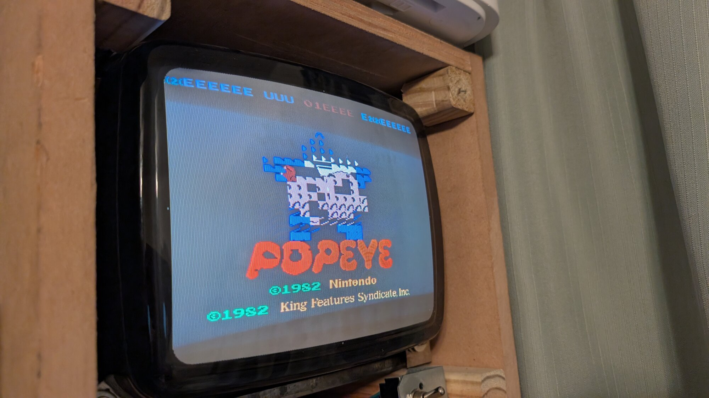
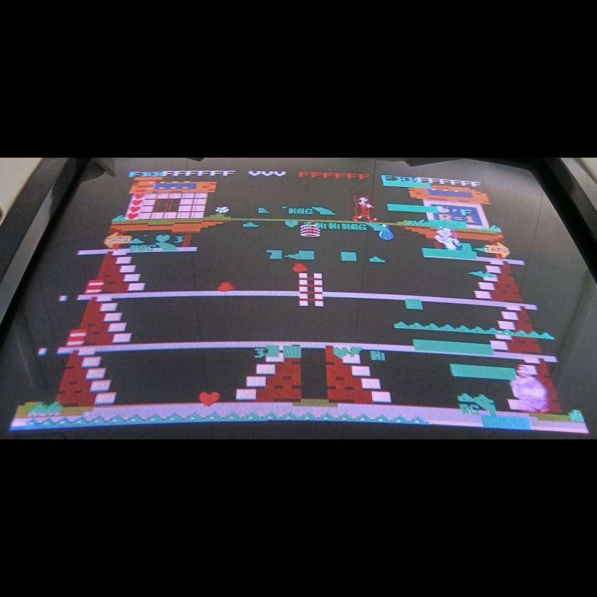
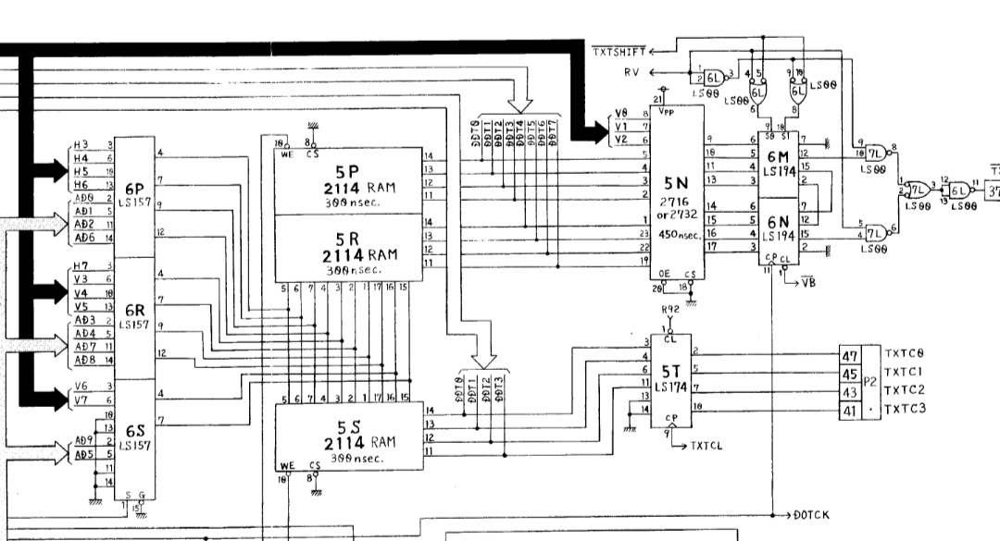

# Sky Skipper (TNX) Repair Logs

## August 25th, 2026
### Symptoms
Corrupted Text Objects, text incorrect and appearing in incorrect locations.

### Tools Used
- Desolder gun

### Troubleshooting Steps
Unfortunately with this game I did not have schematics. So I had to take some guesses based on schematics found on TPP2 hardware. It doesn't match the Sky Skipper TNX PCB sets but it should be close enough to make some educated guesses.

I have seen this kind of behavior on Donkey Kong PCBs. On Some Donkey Kong issues where text objects, many times it ended up being an issue with the 2114 SRAMs int he video RAM section of the video board. Sky Skipper/Popeye has a similar concept. However, there is an extra 2114 SRAM for the palette instead of a fixed color PROM. Looking at the schematics I could see it works in a similar way where the RAM bytes feed into the address of ROM which has the text objects.

One thing I like doing is "piggy-backing" 2114 SRAM in this case. Piggy-backing is where you take a known good IC, in this case a new 2114 SRAM, and place it on top of the chip in question. This will NOT fix the issue and does not always work, however sometimes it can make the game show improvement in the graphics. In this case, it did actually make the text clear up a little bit when I piggy-backed the 2114 at 2H. Replacing the 2114 at 2H resolved the issue.

### Solution
Bad 2114 SRAM at 2H on the video PCB