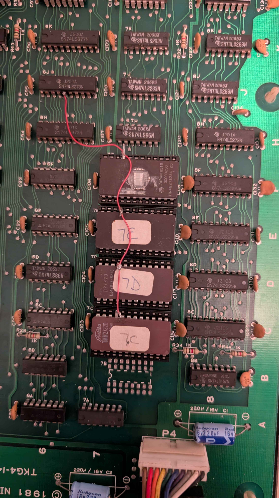

# Special Forces Covnersion Documentation

This provides all the information required to convert a Donkey Kong PCB to *Special Forces: Kung Fu Commando*. This guide applies to TKG4 hardware.

## Daughter Board
### Daughter Board ROM Info

## CPU PCB PROMs

## Video PCB ROMs/PROMs

### Sprite ROM Modification
There is one modification that has to be done with the PCB. For each EPROM, A11 (pin 21) must be lifted out of the socket. From there, each of the lifted pins will be tied together using 30AWG wire, leaving enough to run to a chip after. The tied together pins will run to the 74LS273 at 6J pin 5. Refer to the image below for an example of this modification.

